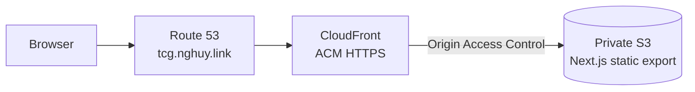

# DevOps TCG

A read-only concept study deck with a modern trading-card-inspired interface.
The first release teaches the Proxy concept and deploys as a static site at
https://tcg.nghuy.link.

## Architecture

DevOps TCG exports a Next.js application to static files. Route 53 directs the
custom domain to CloudFront, which serves a private S3 origin through Origin
Access Control (OAC). Terraform manages AWS resources, and GitHub Actions uses
OIDC instead of long-lived AWS keys.



See [docs/architecture.md](docs/architecture.md) for deployment flow and
resource ownership.

## Features

- One typed, hardcoded Proxy concept card with front/back learning content.
- Mouse, Enter, Space, and explicit Flip-button interaction.
- Visible keyboard focus and reduced-motion support.
- Responsive layout verified at a 320-pixel viewport.
- Local WebP image with a readable load-failure fallback.
- No backend, API, authentication, database, cookies, browser persistence, or
  runtime content downloads.
- Private, encrypted, versioned S3 hosting behind CloudFront OAC.

## Project Structure

```text
.
├── .github/workflows/   # PR quality/plan and production deployment
├── docs/                # Architecture and approved implementation records
├── frontend/            # Next.js static frontend and automated tests
└── infra/
    ├── bootstrap/       # One-time remote-state resources
    ├── envs/prod/       # Production composition and DNS aliases
    └── modules/         # Domain and frontend delivery modules
```

## Prerequisites

- Node.js 20.x and pnpm 9
- Terraform 1.7 or newer for native mock-provider tests
- AWS CLI authenticated to the deployment account
- TFLint, Checkov, and actionlint for the complete local quality suite
- An existing public Route 53 hosted zone named `nghuy.link.`

> [!IMPORTANT]
> The application stack reads the existing hosted zone. It never creates,
> imports, or owns the parent `nghuy.link` zone.

## Local Development

```bash
corepack enable
pnpm --dir frontend install --frozen-lockfile
pnpm --dir frontend dev
```

Open http://localhost:3000. The static frontend needs no `.env` file or runtime
environment variables.

## Test and Quality Commands

```bash
pnpm --dir frontend format:check
pnpm --dir frontend lint
pnpm --dir frontend typecheck
pnpm --dir frontend test:coverage
pnpm --dir frontend build
pnpm --dir frontend exec playwright install chromium
pnpm --dir frontend test:e2e

terraform fmt -check -recursive infra
terraform -chdir=infra/bootstrap test
terraform -chdir=infra/modules/frontend test
terraform -chdir=infra/modules/domain test
terraform -chdir=infra/envs/prod validate
tflint --chdir=infra --recursive
uvx checkov -d infra --quiet
actionlint .github/workflows/quality.yml .github/workflows/deploy.yml
```

Build the frontend before running Playwright because the browser suite serves
`frontend/out/`.

## AWS and GitHub Setup

Create a protected GitHub environment named `production`. Configure these
repository secrets:

- `AWS_PLAN_ROLE_ARN`
- `AWS_DEPLOY_ROLE_ARN`

Configure these repository variables:

- `AWS_REGION`
- `STATE_BUCKET_NAME`
- `LOCK_TABLE_NAME`
- `SITE_BUCKET_NAME`
- `ROUTE53_ZONE_NAME` = `nghuy.link`
- `SITE_DOMAIN` = `tcg.nghuy.link`

Both IAM roles must trust GitHub’s OIDC provider. Keep the plan role read-only
for production resources and grant the deploy role only the S3, CloudFront,
ACM, Route 53, DynamoDB-lock, and Terraform-state permissions required by this
stack.

## First Deployment

1. Create the remote-state bucket and lock table once by following
   [infra/README.md](infra/README.md).
2. Configure the GitHub secrets, variables, and `production` environment.
3. Run the Quality workflow and verify the conditional Terraform plan.
4. Run the Deploy workflow manually or push to `main` after environment
   approval.

The workflow applies Terraform, validates its outputs, synchronizes
`frontend/out/` with `--delete`, invalidates CloudFront, and checks the final
HTTPS URL.

## Verification

```bash
curl --fail --show-error --location https://tcg.nghuy.link
curl --head https://tcg.nghuy.link/images/proxy-thumbnail.webp
```

Confirm that the certificate is valid, the Proxy card flips with mouse and
keyboard input, browser requests contain no external image host, and unknown
paths return the exported 404 page with HTTP 404.

## Adding a Hardcoded Card

1. Add one local optimized image under `frontend/public/images/` and record its
   source in `frontend/public/images/ATTRIBUTION.md`.
2. Add one object satisfying `ConceptCardData` in
   `frontend/src/data/conceptCards.ts`.
3. Extend the content-contract and browser tests for the new card.

Deck navigation is data-driven; no component redesign is required.

## Safe Teardown

1. Resolve and confirm the exact production site bucket name.
2. Empty every current object and every object version from the site bucket.
3. Destroy `infra/envs/prod`.
4. Confirm that no Terraform stack still uses the remote backend.
5. Empty every object version from the state bucket.
6. Destroy `infra/bootstrap` only when the backend is no longer needed.

Destroying production removes only the `tcg.nghuy.link` records and
certificate. It does not remove the parent hosted zone or unrelated DNS
records.

## Image Attribution

The Proxy thumbnail is derived from Manuel Luikenga’s Unsplash photo “Ethernet
cables connected to the back of a network device.” Full source and license
details are recorded in
[frontend/public/images/ATTRIBUTION.md](frontend/public/images/ATTRIBUTION.md).
