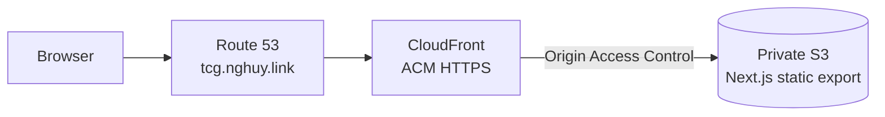

# DevOps TCG

A read-only concept study deck that presents DevOps topics through an accessible,
modern trading-card-inspired interface. The first release teaches the **Proxy**
concept and is designed for static delivery at
[tcg.nghuy.link](https://tcg.nghuy.link).

> [!IMPORTANT]
> DevOps TCG is currently in the pre-implementation phase. The product design
> and implementation plan are approved, but the frontend, infrastructure, and
> deployment workflows have not been built yet.

## Planned Experience

- One hardcoded Proxy study card with complementary front and back content.
- Mouse and keyboard card-flip interaction with reduced-motion support.
- Responsive presentation from 320-pixel mobile screens through desktop.
- No backend, database, authentication, browser persistence, or runtime content
  downloads.
- An original visual identity that does not copy proprietary trading-card
  artwork or layouts.

## Planned Architecture

The frontend will use Next.js 14, React 18, TypeScript, and Tailwind CSS. AWS
infrastructure will be managed with Terraform and deployed through GitHub
Actions using OpenID Connect instead of long-lived AWS credentials.

## Repository Status

The repository currently contains the approved specifications and plans:

- [Product design](docs/superpowers/specs/2026-08-13-devops-tcg-design.md)
- [Application implementation plan](docs/superpowers/plans/2026-08-13-devops-tcg.md)
- [Repository baseline design](docs/superpowers/specs/2026-08-14-repository-baseline-design.md)
- [Repository baseline implementation plan](docs/superpowers/plans/2026-08-14-repository-baseline.md)

Application directories such as `frontend/`, `infra/`, and `.github/workflows/`
will be added by the implementation plan.

## Roadmap

1. Build the typed static frontend and accessible card interaction.
2. Add responsive styling, unit tests, and browser acceptance tests.
3. Provision private S3, CloudFront, ACM, and Route 53 resources with Terraform.
4. Add pull-request validation and protected production deployment workflows.
5. Complete verified development, operations, and teardown documentation.
