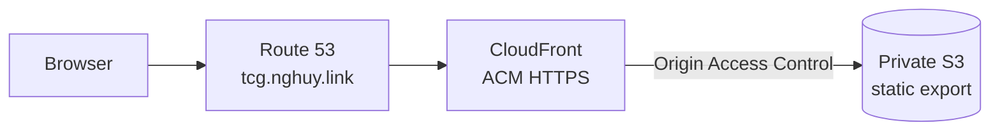
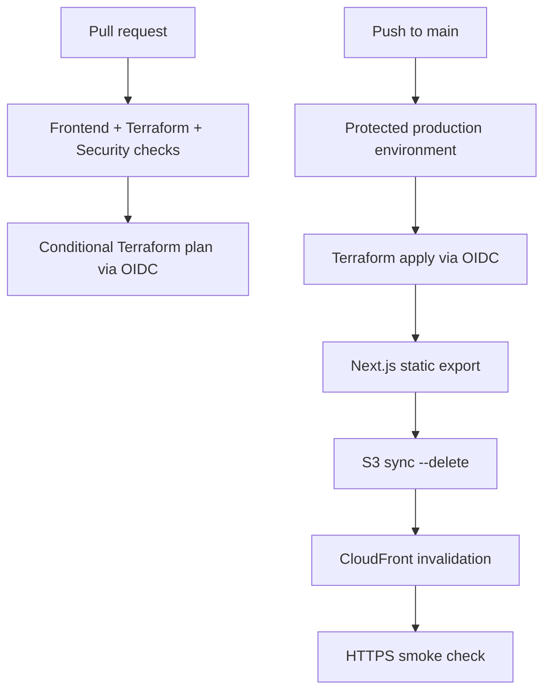

# DevOps TCG Architecture

DevOps TCG is a static, read-only study deck. It has no server runtime or
application data plane beyond CloudFront reading committed static files from a
private S3 origin.

## Runtime Request Flow



Route 53 A and AAAA aliases target CloudFront. CloudFront redirects HTTP to
HTTPS, negotiates TLS with an ACM certificate created in `us-east-1`, applies
browser security headers, and signs origin requests with OAC. The S3 bucket
rejects public access and permits object reads only from the distribution ARN.

## Delivery Flow



The deployment workflow builds and tests the frontend before Terraform apply,
then creates a fresh deployable export after validating Terraform outputs. The
diagram groups pre-apply quality work into the protected Deploy stage and shows
the final publish sequence after infrastructure is available.

## Resource Ownership

| Directory | Responsibility |
| --- | --- |
| `frontend/` | Typed card content, accessible interaction, static export, unit and browser tests |
| `infra/bootstrap/` | One-time private/versioned S3 state bucket and DynamoDB lock table |
| `infra/modules/domain/` | Existing public-zone lookup, exact-domain ACM certificate, and DNS validation records |
| `infra/modules/frontend/` | Private/versioned site bucket, OAC, bucket policy, CloudFront caching, HTTPS, headers, and 404 behavior |
| `infra/envs/prod/` | Regional providers, module composition, `tcg.nghuy.link` A/AAAA aliases, and deploy outputs |
| `.github/workflows/quality.yml` | Frontend gates, offline infrastructure checks, and conditional OIDC plan |
| `.github/workflows/deploy.yml` | Protected OIDC apply, static publish, invalidation, and HTTPS smoke check |

The `nghuy.link.` hosted zone is external shared infrastructure. Terraform reads
its ID and manages only records required by `tcg.nghuy.link`.

## Static Build Data

```text
ConceptCardData + local WebP
  -> Next.js static export
  -> frontend/out
  -> aws s3 sync --delete
  -> CloudFront invalidation
```

The browser makes no application API calls and receives no application
credentials, cookies, or user-specific content.

## Intentionally Absent

- Cognito or any authentication provider
- API Gateway or Next.js API routes
- Lambda or another server runtime
- Application DynamoDB tables or another database
- CloudFront `/api/*` behavior
- Runtime image or card-content downloads
- Accounts, scores, progress, or any user state beyond the theme choice
- Browser persistence other than a single `localStorage` key,
  `devops-tcg-theme`, holding `neon` or `sketch`. It is read by a pre-paint
  inline script and by the header toggle, it is never sent anywhere, and an
  unreadable or unrecognised value resolves to the neon default.
