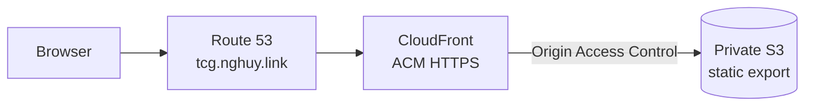
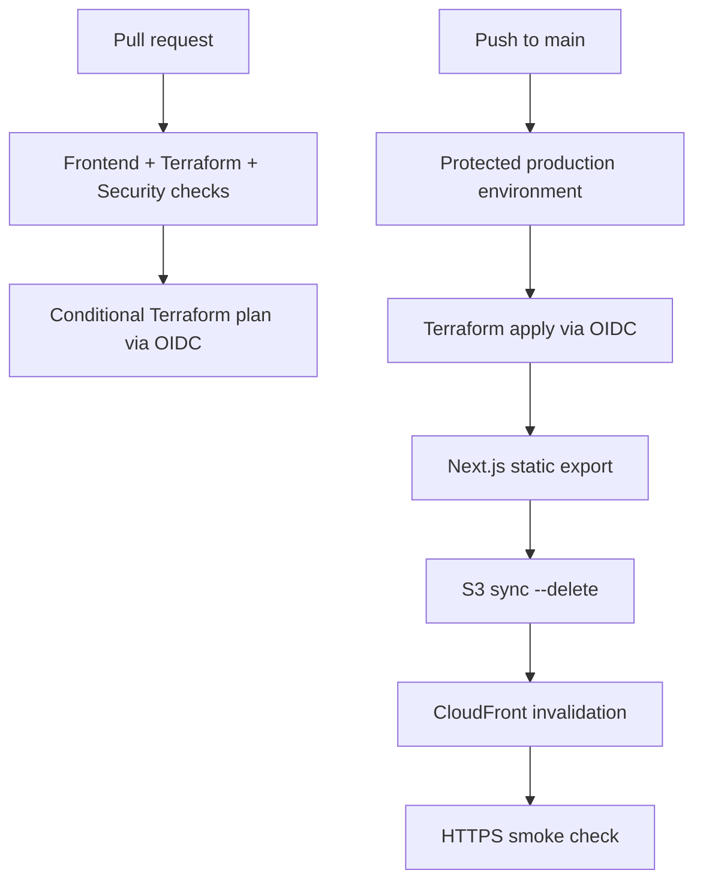

# DevOps TCG Implementation Plan

> **For agentic workers:** REQUIRED SUB-SKILL: Use superpowers:subagent-driven-development (recommended) or superpowers:executing-plans to implement this plan task-by-task. Steps use checkbox (`- [ ]`) syntax for tracking.

**Goal:** Build and deploy a read-only, modern trading-card-inspired Next.js flash-card site containing one Proxy concept card at `https://tcg.nghuy.link`.

**Architecture:** A typed, hardcoded card collection feeds accessible client-side React components that Next.js exports as static files. Terraform provisions a private, versioned S3 origin, CloudFront OAC distribution, `us-east-1` ACM certificate, and Route 53 aliases in the existing `nghuy.link` zone; GitHub Actions validates and deploys through AWS OIDC.

**Tech Stack:** Node.js 20.x, pnpm 9, Next.js 14, React 18, TypeScript, Tailwind CSS 3, Vitest, Testing Library, Playwright, Terraform >= 1.6, AWS provider ~> 5.0, TFLint, Checkov, GitHub Actions, Amazon S3, CloudFront, ACM, and Route 53.

## Global Constraints

- The site is read-only and contains exactly one hardcoded concept card, **Proxy**, in version one.
- There is no backend, Next.js server runtime, API route, middleware, SSR, database, authentication, browser persistence, or runtime content fetch.
- Use Next.js static export with `output: "export"`, React 18, TypeScript, pnpm 9, and Node.js 20.x.
- Store the optimized Proxy image at `frontend/public/images/proxy-thumbnail.webp`; production must not hotlink any image.
- The front contains Basic Definition and Key words; the back contains Components and How It Works and has no image.
- Clicking the card or Flip button and pressing Enter or Space while the card is focused must flip it.
- Honor `prefers-reduced-motion: reduce`, provide visible focus, use semantic disabled controls, and prevent horizontal page overflow at 320 pixels.
- Use an original modern trading-card visual system; do not use Pokémon logos, characters, names, scans, copied artwork, or a reproduction of a proprietary card frame.
- Deploy at `https://tcg.nghuy.link` by reading, never creating or owning, the existing public Route 53 zone `nghuy.link.`.
- Provision the ACM certificate in `us-east-1`; provision the site bucket in `AWS_REGION`.
- Keep the S3 site bucket private, encrypted, versioned, and accessible only through CloudFront OAC.
- Authenticate GitHub Actions to AWS with OIDC and separate plan and deploy roles; do not store long-lived AWS keys.
- Follow `/Users/huyng/ws/aws-serverless-webapp/` for static export, private S3/CloudFront, Terraform bootstrap, remote state, OIDC, workflow structure, and documentation conventions while omitting every backend service.
- Keep production modules compatible with Terraform >= 1.6; run mock-provider native tests with Terraform >= 1.7, where `mock_provider` and data overrides are available.

## Planned File Structure

```text
.
├── .github/workflows/{quality.yml,deploy.yml}
├── .nvmrc
├── README.md
├── docs/architecture.md
├── frontend/
│   ├── public/images/{ATTRIBUTION.md,proxy-thumbnail.webp}
│   ├── src/app/{globals.css,layout.tsx,page.tsx,page.test.tsx}
│   ├── src/components/{CardFront.tsx,CardBack.tsx,ConceptCard.tsx,ConceptDeck.tsx,DeckControls.tsx,ConceptDeck.test.tsx}
│   ├── src/data/{conceptCards.ts,conceptCards.test.ts}
│   ├── src/types/concept.ts
│   ├── e2e/concept-deck.spec.ts
│   ├── README.md
│   ├── package.json
│   ├── pnpm-lock.yaml
│   └── TypeScript, Next.js, Tailwind, Vitest, ESLint, PostCSS, and Playwright configuration
└── infra/
    ├── bootstrap/{providers.tf,variables.tf,main.tf,outputs.tf,tests/bootstrap.tftest.hcl}
    ├── envs/prod/{backend.tf,versions.tf,variables.tf,main.tf,outputs.tf,terraform.tfvars.example}
    ├── modules/domain/{versions.tf,variables.tf,main.tf,outputs.tf,tests/domain.tftest.hcl}
    ├── modules/frontend/{variables.tf,main.tf,outputs.tf,tests/frontend.tftest.hcl}
    └── README.md
```

---

### Task 1: Static Frontend Foundation and Typed Proxy Content

**Files:**
- Create: `.nvmrc`
- Create: `frontend/package.json`
- Create: `frontend/pnpm-lock.yaml`
- Create: `frontend/tsconfig.json`
- Create: `frontend/next-env.d.ts`
- Create: `frontend/next.config.mjs`
- Create: `frontend/.eslintrc.json`
- Create: `frontend/postcss.config.mjs`
- Create: `frontend/tailwind.config.ts`
- Create: `frontend/vitest.config.ts`
- Create: `frontend/vitest.setup.ts`
- Create: `frontend/src/types/concept.ts`
- Create: `frontend/src/data/conceptCards.test.ts`
- Create: `frontend/src/data/conceptCards.ts`
- Create: `frontend/public/images/ATTRIBUTION.md`
- Create: `frontend/public/images/proxy-thumbnail.webp`

**Interfaces:**
- Consumes: The approved Proxy copy and image source from the design specification.
- Produces: `ConceptCardData`, `ConceptComponentData`, `HowItWorksStep`, and `conceptCards: readonly ConceptCardData[]` for every UI task.

- [ ] **Step 1: Add the Node and frontend toolchain manifests**

Create `.nvmrc` containing `20`. Create `frontend/package.json`:

```json
{
  "name": "devops-tcg-frontend",
  "version": "1.0.0",
  "private": true,
  "packageManager": "pnpm@9.15.0",
  "scripts": {
    "dev": "next dev",
    "build": "next build",
    "lint": "next lint",
    "typecheck": "tsc --noEmit",
    "format:check": "prettier --check .",
    "test": "vitest run",
    "test:coverage": "vitest run --coverage",
    "test:e2e": "playwright test"
  },
  "dependencies": {
    "next": "^14.2.4",
    "react": "^18.3.1",
    "react-dom": "^18.3.1"
  },
  "devDependencies": {
    "@playwright/test": "^1.46.1",
    "@testing-library/jest-dom": "^6.4.8",
    "@testing-library/react": "^16.0.1",
    "@testing-library/user-event": "^14.5.2",
    "@types/node": "^20.14.0",
    "@types/react": "^18.3.3",
    "@types/react-dom": "^18.3.0",
    "@vitest/coverage-v8": "^2.0.5",
    "autoprefixer": "^10.4.20",
    "eslint": "^8.57.0",
    "eslint-config-next": "^14.2.4",
    "jsdom": "^24.1.1",
    "postcss": "^8.4.47",
    "prettier": "^3.3.3",
    "serve": "^14.2.3",
    "tailwindcss": "^3.4.10",
    "typescript": "^5.4.5",
    "vitest": "^2.0.5"
  }
}
```

Run:

```bash
cd frontend
corepack enable
pnpm install
```

Expected: installation succeeds and pnpm 9 creates `pnpm-lock.yaml`.

- [ ] **Step 2: Add strict static-export and test configuration**

Create `next.config.mjs`:

```js
/** @type {import('next').NextConfig} */
const nextConfig = {
  output: "export",
  images: { unoptimized: true },
  poweredByHeader: false,
};

export default nextConfig;
```

Create `vitest.config.ts`:

```ts
import path from "node:path";
import { defineConfig } from "vitest/config";

export default defineConfig({
  resolve: { alias: { "@": path.resolve(__dirname, "src") } },
  test: {
    environment: "jsdom",
    setupFiles: ["./vitest.setup.ts"],
    coverage: {
      provider: "v8",
      reporter: ["text", "lcov"],
      include: ["src/**/*.{ts,tsx}"],
      thresholds: { lines: 85, functions: 85, branches: 80, statements: 85 },
    },
  },
});
```

Create `vitest.setup.ts`:

```ts
import "@testing-library/jest-dom/vitest";
import { cleanup } from "@testing-library/react";
import { afterEach } from "vitest";

afterEach(cleanup);
```

Configure `tsconfig.json` with `strict: true`, `noEmit: true`, JSX preservation,
the `@/* -> ./src/*` alias, and the Next.js TypeScript plugin. Configure Tailwind
content paths as `./src/**/*.{js,ts,jsx,tsx,mdx}` and PostCSS with Tailwind and
Autoprefixer. Create `.eslintrc.json` with
`{ "extends": ["next/core-web-vitals"] }`.

Use these exact configuration bodies:

```json
// tsconfig.json
{
  "compilerOptions": {
    "target": "ES2017",
    "lib": ["dom", "dom.iterable", "esnext"],
    "allowJs": false,
    "skipLibCheck": true,
    "strict": true,
    "noEmit": true,
    "esModuleInterop": true,
    "module": "esnext",
    "moduleResolution": "bundler",
    "resolveJsonModule": true,
    "isolatedModules": true,
    "jsx": "preserve",
    "incremental": true,
    "plugins": [{ "name": "next" }],
    "paths": { "@/*": ["./src/*"] }
  },
  "include": ["next-env.d.ts", "**/*.ts", "**/*.tsx", ".next/types/**/*.ts"],
  "exclude": ["node_modules"]
}
```

```ts
// tailwind.config.ts
import type { Config } from "tailwindcss";

export default {
  content: ["./src/**/*.{js,ts,jsx,tsx,mdx}"],
  theme: { extend: {} },
  plugins: [],
} satisfies Config;
```

```js
// postcss.config.mjs
export default { plugins: { tailwindcss: {}, autoprefixer: {} } };
```

Create `next-env.d.ts`:

```ts
/// <reference types="next" />
/// <reference types="next/image-types/global" />

// This file is generated for Next.js types and should remain unchanged.
```

- [ ] **Step 3: Write the failing content-contract test**

Create `src/data/conceptCards.test.ts`:

```ts
import { describe, expect, it } from "vitest";
import { conceptCards } from "./conceptCards";

describe("conceptCards", () => {
  it("contains the complete Proxy learning contract", () => {
    expect(conceptCards).toHaveLength(1);
    expect(conceptCards[0]).toMatchObject({
      id: "proxy",
      cardNumber: "#001",
      type: "NETWORK",
      title: "Proxy",
      descriptor: "INTERMEDIARY",
      image: {
        src: "/images/proxy-thumbnail.webp",
        alt: "Ethernet cables connected to network equipment",
      },
      definition:
        "A proxy receives a request from one system and forwards it to another on the requester’s behalf.",
      keywords: ["intermediary", "forward proxy", "reverse proxy", "routing", "caching"],
    });
    expect(conceptCards[0].components).toHaveLength(3);
    expect(conceptCards[0].howItWorks).toHaveLength(4);
  });

  it("has no empty required content", () => {
    for (const card of conceptCards) {
      expect(Object.values(card.image).every(Boolean)).toBe(true);
      expect(card.keywords.every(Boolean)).toBe(true);
      expect(card.components.every(({ name, description }) => name && description)).toBe(true);
      expect(card.howItWorks.every(({ step, description }) => step > 0 && description)).toBe(true);
    }
  });
});
```

- [ ] **Step 4: Run the test and confirm the missing module failure**

Run `pnpm --dir frontend test -- src/data/conceptCards.test.ts`.

Expected: FAIL because `./conceptCards` does not exist.

- [ ] **Step 5: Implement the typed content model and Proxy card**

Create `src/types/concept.ts`:

```ts
export interface ConceptComponentData {
  readonly name: string;
  readonly description: string;
}

export interface HowItWorksStep {
  readonly step: number;
  readonly description: string;
}

export interface ConceptCardData {
  readonly id: string;
  readonly cardNumber: string;
  readonly series: string;
  readonly type: string;
  readonly title: string;
  readonly descriptor: string;
  readonly image: { readonly src: string; readonly alt: string };
  readonly definition: string;
  readonly keywords: readonly string[];
  readonly components: readonly ConceptComponentData[];
  readonly howItWorks: readonly HowItWorksStep[];
}
```

Create `src/data/conceptCards.ts`:

```ts
import type { ConceptCardData } from "@/types/concept";

export const conceptCards = [
  {
    id: "proxy",
    cardNumber: "#001",
    series: "NETWORK SERIES",
    type: "NETWORK",
    title: "Proxy",
    descriptor: "INTERMEDIARY",
    image: {
      src: "/images/proxy-thumbnail.webp",
      alt: "Ethernet cables connected to network equipment",
    },
    definition:
      "A proxy receives a request from one system and forwards it to another on the requester’s behalf.",
    keywords: ["intermediary", "forward proxy", "reverse proxy", "routing", "caching"],
    components: [
      { name: "Client", description: "Originates the request." },
      {
        name: "Proxy",
        description: "Receives traffic and applies routing, security, or caching rules.",
      },
      {
        name: "Destination server",
        description: "Processes the forwarded request and returns a response.",
      },
    ],
    howItWorks: [
      { step: 1, description: "The client sends its request to the proxy." },
      {
        step: 2,
        description: "The proxy evaluates the request and applies configured policies.",
      },
      {
        step: 3,
        description: "An allowed request is forwarded to the destination server.",
      },
      { step: 4, description: "The response returns through the proxy to the client." },
    ],
  },
] as const satisfies readonly ConceptCardData[];
```

- [ ] **Step 6: Download the free image and record attribution**

Run with approved network access:

```bash
mkdir -p frontend/public/images
curl --fail --location 'https://images.unsplash.com/photo-1783683783819-e6cb806bba69?auto=format&fit=crop&fm=webp&q=85&w=900' --output frontend/public/images/proxy-thumbnail.webp
file frontend/public/images/proxy-thumbnail.webp
```

Expected: WebP image data. Create `public/images/ATTRIBUTION.md` with the photo
title, Manuel Luikenga as creator, the source URL from the approved spec, and
`https://unsplash.com/license`.

- [ ] **Step 7: Run content and type checks**

```bash
pnpm --dir frontend test -- src/data/conceptCards.test.ts
pnpm --dir frontend typecheck
```

Expected: PASS.

- [ ] **Step 8: Commit the foundation**

```bash
git add .nvmrc frontend
git commit -m "feat: add typed proxy card content"
```

---

### Task 2: Accessible Flash-Card Components

**Files:**
- Create: `frontend/src/components/CardFront.tsx`
- Create: `frontend/src/components/CardBack.tsx`
- Create: `frontend/src/components/DeckControls.tsx`
- Create: `frontend/src/components/ConceptCard.tsx`
- Create: `frontend/src/components/ConceptDeck.tsx`
- Create: `frontend/src/components/ConceptDeck.test.tsx`

**Interfaces:**
- Consumes: `ConceptCardData` and `conceptCards` from Task 1.
- Produces: `ConceptDeck({ cards }: { cards: readonly ConceptCardData[] })`, used by the page and browser tests.

- [ ] **Step 1: Write failing interaction and fallback tests**

Create `src/components/ConceptDeck.test.tsx`:

```tsx
import { fireEvent, render, screen, within } from "@testing-library/react";
import userEvent from "@testing-library/user-event";
import { describe, expect, it } from "vitest";
import { conceptCards } from "@/data/conceptCards";
import { ConceptDeck } from "./ConceptDeck";

describe("ConceptDeck", () => {
  it("renders the Proxy front and disables one-card navigation", () => {
    render(<ConceptDeck cards={conceptCards} />);
    expect(screen.getByText(conceptCards[0].definition)).toBeInTheDocument();
    for (const keyword of conceptCards[0].keywords) expect(screen.getByText(keyword)).toBeInTheDocument();
    expect(screen.getByRole("button", { name: "Previous card" })).toBeDisabled();
    expect(screen.getByRole("button", { name: "Next card" })).toBeDisabled();
  });

  it("flips with the control, Enter, Space, and card click", async () => {
    const user = userEvent.setup();
    render(<ConceptDeck cards={conceptCards} />);
    const card = screen.getByRole("button", { name: "Proxy card, front shown" });
    const front = screen.getByTestId("card-front");
    const back = screen.getByTestId("card-back");
    await user.click(screen.getByRole("button", { name: "Show card back" }));
    expect(front).toHaveAttribute("aria-hidden", "true");
    expect(back).toHaveAttribute("aria-hidden", "false");
    card.focus();
    await user.keyboard("{Enter}");
    expect(front).toHaveAttribute("aria-hidden", "false");
    await user.keyboard(" ");
    expect(back).toHaveAttribute("aria-hidden", "false");
    await user.click(card);
    expect(front).toHaveAttribute("aria-hidden", "false");
  });

  it("renders all back-face learning content", async () => {
    const user = userEvent.setup();
    render(<ConceptDeck cards={conceptCards} />);
    await user.click(screen.getByRole("button", { name: "Show card back" }));
    const back = screen.getByTestId("card-back");
    for (const item of conceptCards[0].components) {
      expect(within(back).getByText(item.name)).toBeInTheDocument();
      expect(within(back).getByText(item.description)).toBeInTheDocument();
    }
    for (const item of conceptCards[0].howItWorks) {
      expect(within(back).getByText(item.description)).toBeInTheDocument();
    }
  });

  it("shows readable fallback content when the local image fails", () => {
    render(<ConceptDeck cards={conceptCards} />);
    fireEvent.error(screen.getByRole("img", { name: conceptCards[0].image.alt }));
    expect(screen.getByText("Proxy network concept")).toBeInTheDocument();
  });
});
```

- [ ] **Step 2: Run the test and confirm the missing component failure**

Run `pnpm --dir frontend test -- src/components/ConceptDeck.test.tsx`.

Expected: FAIL because `./ConceptDeck` does not exist.

- [ ] **Step 3: Implement the two card faces**

Implement `CardFront({ card }: { card: ConceptCardData })` with local
`imageFailed` state. Render ``; on
error replace it with `<div role="img" aria-label={card.image.alt}>Proxy network
concept</div>`. Render the exact definition and keyword array.

Implement `CardBack({ card }: { card: ConceptCardData })` with no image. Use a
definition list for components and an ordered list for flow:

```tsx
<dl>
  {card.components.map((item) => (
    <div key={item.name}><dt>{item.name}</dt><dd>{item.description}</dd></div>
  ))}
</dl>
<ol>
  {card.howItWorks.map((item) => (
    <li key={item.step}><span aria-hidden="true">{item.step}</span><span>{item.description}</span></li>
  ))}
</ol>
```

- [ ] **Step 4: Implement controls and card-owned flip state**

Use this interface:

```ts
interface DeckControlsProps {
  readonly canGoPrevious: boolean;
  readonly canGoNext: boolean;
  readonly isFlipped: boolean;
  readonly onPrevious: () => void;
  readonly onFlip: () => void;
  readonly onNext: () => void;
}
```

Use actual disabled buttons and label the flip control `Show card back` or `Show
card front`. `ConceptCard` receives the card, both booleans, and both navigation
callbacks, but owns `isFlipped`. Its interactive wrapper must implement:

```tsx
<div
  role="button"
  tabIndex={0}
  aria-label={`${card.title} card, ${isFlipped ? "back" : "front"} shown`}
  aria-pressed={isFlipped}
  data-face={isFlipped ? "back" : "front"}
  onClick={toggleCard}
  onKeyDown={(event) => {
    if (event.key === "Enter" || event.key === " ") {
      event.preventDefault();
      toggleCard();
    }
  }}
>
  <section data-testid="card-front" aria-hidden={isFlipped}><CardFront card={card} /></section>
  <section data-testid="card-back" aria-hidden={!isFlipped}><CardBack card={card} /></section>
</div>
```

Render `DeckControls` as a sibling after the interactive card wrapper, never as
a descendant of the element with `role="button"`, so its button clicks toggle
exactly once and do not create nested interactive controls.

- [ ] **Step 5: Implement bounded deck navigation**

`ConceptDeck` keeps `activeIndex`, uses `activeIndex > 0` and
`activeIndex < cards.length - 1` for navigation, keys `ConceptCard` by `card.id`,
and renders `No concept cards available.` for an empty input.

- [ ] **Step 6: Run tests and type checks**

```bash
pnpm --dir frontend test -- src/components/ConceptDeck.test.tsx
pnpm --dir frontend typecheck
```

Expected: PASS.

- [ ] **Step 7: Commit accessible behavior**

```bash
git add frontend/src/components
git commit -m "feat: add accessible flash card interaction"
```

---

### Task 3: Modern Trading-Card Page and Responsive Styling

**Files:**
- Create: `frontend/src/app/layout.tsx`
- Create: `frontend/src/app/page.tsx`
- Create: `frontend/src/app/globals.css`
- Create: `frontend/src/app/page.test.tsx`
- Modify: `frontend/src/components/CardFront.tsx`
- Modify: `frontend/src/components/CardBack.tsx`
- Modify: `frontend/src/components/ConceptCard.tsx`
- Modify: `frontend/src/components/DeckControls.tsx`
- Modify: `frontend/src/components/ConceptDeck.tsx`

**Interfaces:**
- Consumes: `ConceptDeck` and `conceptCards` from Tasks 1–2.
- Produces: A complete static `/` page and stable `.concept-card`, `.concept-card-inner`, `.card-face-front`, and `.card-face-back` selectors.

- [ ] **Step 1: Write the failing page composition test**

Create `src/app/page.test.tsx`:

```tsx
import { render, screen } from "@testing-library/react";
import { describe, expect, it } from "vitest";
import Home from "./page";

describe("Home", () => {
  it("renders deck identity, count, card, and instruction", () => {
    render(<Home />);
    expect(screen.getByRole("heading", { name: "DevOps TCG" })).toBeInTheDocument();
    expect(screen.getByText("01 / 01")).toBeInTheDocument();
    expect(screen.getByRole("button", { name: "Proxy card, front shown" })).toBeInTheDocument();
    expect(screen.getByText(/click the card or use enter or space/i)).toBeInTheDocument();
  });
});
```

- [ ] **Step 2: Run the test and confirm the missing page failure**

Run `pnpm --dir frontend test -- src/app/page.test.tsx`.

Expected: FAIL because `src/app/page.tsx` does not exist.

- [ ] **Step 3: Compose the static page and metadata**

Create metadata with title `DevOps TCG | Concept Study Deck`, description
`Learn DevOps concepts through an accessible trading-card-inspired study deck.`,
and `metadataBase: new URL("https://tcg.nghuy.link")`.

Create `page.tsx`:

```tsx
import { ConceptDeck } from "@/components/ConceptDeck";
import { conceptCards } from "@/data/conceptCards";

export default function Home() {
  return (
    <main>
      <header>
        <p>CONCEPT STUDY DECK</p>
        <h1>DevOps TCG</h1>
        <p aria-label={`${conceptCards.length} card in this deck`}>01 / 01</p>
      </header>
      <ConceptDeck cards={conceptCards} />
      <p>Click the card or use Enter or Space to flip it.</p>
    </main>
  );
}
```

- [ ] **Step 4: Apply the approved modern visual system**

Use Tailwind utilities for responsive layout, typography, spacing, focus rings,
buttons, keyword chips, and text panels. Add the core 3D rules to `globals.css`:

```css
@tailwind base;
@tailwind components;
@tailwind utilities;

:root {
  color-scheme: dark;
  --stage: #050714;
  --surface: #0a1730;
  --cyan: #67e8f9;
  --violet: #a78bfa;
}

* { box-sizing: border-box; }
html { min-width: 320px; background: var(--stage); }
body { margin: 0; min-height: 100vh; overflow-x: hidden; }
.concept-card { perspective: 1200px; }
.concept-card-inner {
  position: relative;
  transform-style: preserve-3d;
  transition: transform 600ms cubic-bezier(.2,.75,.25,1);
}
.concept-card[data-face="back"] .concept-card-inner { transform: rotateY(180deg); }
.card-face-front,
.card-face-back {
  backface-visibility: hidden;
  -webkit-backface-visibility: hidden;
}
.card-face-back { position: absolute; inset: 0; transform: rotateY(180deg); }
@media (prefers-reduced-motion: reduce) {
  .concept-card-inner { transition-duration: 0s; }
}
```

Use a cyan/violet/gold edge, dark layered surface, full-bleed front image,
glass-like panels, and text-only back. Set card width to `min(100%, 350px)` and
keep all content inside the 320-pixel viewport without truncating text.

- [ ] **Step 5: Run frontend quality checks and static export**

```bash
pnpm --dir frontend format:check
pnpm --dir frontend lint
pnpm --dir frontend typecheck
pnpm --dir frontend test
pnpm --dir frontend build
test -f frontend/out/index.html
test -f frontend/out/404.html
test -f frontend/out/images/proxy-thumbnail.webp
```

Expected: every command PASS and all three exported files exist.

- [ ] **Step 6: Commit the complete page**

```bash
git add frontend/src/app frontend/src/components
git commit -m "feat: style modern proxy study card"
```

---

### Task 4: Static-Export Browser Acceptance Tests

**Files:**
- Create: `frontend/playwright.config.ts`
- Create: `frontend/e2e/concept-deck.spec.ts`

**Interfaces:**
- Consumes: `frontend/out` and selectors from Task 3.
- Produces: `pnpm test:e2e`, used by both GitHub workflows.

- [ ] **Step 1: Configure Playwright to serve the export**

Create `playwright.config.ts`:

```ts
import { defineConfig, devices } from "@playwright/test";

export default defineConfig({
  testDir: "./e2e",
  fullyParallel: true,
  forbidOnly: Boolean(process.env.CI),
  retries: process.env.CI ? 2 : 0,
  reporter: process.env.CI ? "github" : "list",
  use: { baseURL: "http://127.0.0.1:4173", trace: "on-first-retry" },
  projects: [
    { name: "chromium", use: { ...devices["Desktop Chrome"] } },
    { name: "mobile", use: { viewport: { width: 320, height: 700 } } },
  ],
  webServer: {
    command: "pnpm exec serve out --listen 4173",
    url: "http://127.0.0.1:4173",
    reuseExistingServer: !process.env.CI,
  },
});
```

- [ ] **Step 2: Write failing browser acceptance tests**

Create `e2e/concept-deck.spec.ts`:

```ts
import { expect, test } from "@playwright/test";

test("loads front-first and flips both directions", async ({ page }) => {
  await page.goto("/");
  const card = page.getByRole("button", { name: "Proxy card, front shown" });
  await expect(card).toHaveAttribute("data-face", "front");
  await page.getByRole("button", { name: "Show card back" }).click();
  await expect(page.getByRole("button", { name: "Proxy card, back shown" })).toHaveAttribute("data-face", "back");
  await expect(page.getByRole("heading", { name: "Components" })).toBeVisible();
  await expect(page.getByRole("heading", { name: "How it works" })).toBeVisible();
  await page.getByRole("button", { name: "Show card front" }).click();
  await expect(card).toHaveAttribute("data-face", "front");
});

test("supports keyboard use and one-card navigation", async ({ page }) => {
  await page.goto("/");
  const card = page.getByRole("button", { name: "Proxy card, front shown" });
  await card.focus();
  await page.keyboard.press("Enter");
  await expect(page.getByRole("button", { name: "Proxy card, back shown" })).toBeFocused();
  await page.keyboard.press("Space");
  await expect(card).toHaveAttribute("data-face", "front");
  await expect(page.getByRole("button", { name: "Previous card" })).toBeDisabled();
  await expect(page.getByRole("button", { name: "Next card" })).toBeDisabled();
});

test("uses a local image only", async ({ page }) => {
  const externalImages: string[] = [];
  page.on("request", (request) => {
    if (request.resourceType() === "image" && new URL(request.url()).hostname !== "127.0.0.1") {
      externalImages.push(request.url());
    }
  });
  await page.goto("/");
  const image = page.getByRole("img", { name: "Ethernet cables connected to network equipment" });
  await expect(image).toHaveAttribute("src", "/images/proxy-thumbnail.webp");
  await expect.poll(() => image.evaluate((node: HTMLImageElement) => node.naturalWidth)).toBeGreaterThan(0);
  expect(externalImages).toEqual([]);
});

test("does not overflow at 320 pixels", async ({ page }, testInfo) => {
  test.skip(testInfo.project.name !== "mobile");
  await page.goto("/");
  const size = await page.evaluate(() => ({
    viewport: document.documentElement.clientWidth,
    content: document.documentElement.scrollWidth,
  }));
  expect(size.content).toBeLessThanOrEqual(size.viewport);
});

test("removes transition for reduced motion", async ({ page }) => {
  await page.emulateMedia({ reducedMotion: "reduce" });
  await page.goto("/");
  await expect.poll(() => page.locator(".concept-card-inner").evaluate(
    (node) => getComputedStyle(node).transitionDuration,
  )).toBe("0s");
});
```

- [ ] **Step 3: Run tests and observe unmet acceptance behavior**

```bash
pnpm --dir frontend exec playwright install chromium
pnpm --dir frontend build
pnpm --dir frontend test:e2e
```

Expected before final adjustments: at least one test FAILS and names the missing
heading, selector, focus behavior, or sizing contract.

- [ ] **Step 4: Make the smallest implementation adjustments**

Use real `<h2>` elements for Components and How it works, preserve card focus
after keyboard flips, and correct only width/padding rules that cause measured
overflow. Do not weaken assertions.

- [ ] **Step 5: Run the complete frontend acceptance suite**

```bash
pnpm --dir frontend format:check
pnpm --dir frontend lint
pnpm --dir frontend typecheck
pnpm --dir frontend test:coverage
pnpm --dir frontend build
pnpm --dir frontend test:e2e
```

Expected: PASS and coverage thresholds met.

- [ ] **Step 6: Commit browser coverage**

```bash
git add frontend
git commit -m "test: cover static card experience"
```

---

### Task 5: Terraform Remote-State Bootstrap

**Files:**
- Create: `infra/bootstrap/providers.tf`
- Create: `infra/bootstrap/variables.tf`
- Create: `infra/bootstrap/main.tf`
- Create: `infra/bootstrap/outputs.tf`
- Create: `infra/bootstrap/tests/bootstrap.tftest.hcl`

**Interfaces:**
- Consumes: `region`, `state_bucket_name`, and optional `lock_table_name`.
- Produces: `state_bucket_name` and `lock_table_name` for local and CI initialization.

- [ ] **Step 1: Write the failing native Terraform test**

Create `infra/bootstrap/tests/bootstrap.tftest.hcl`:

```hcl
mock_provider "aws" {}

run "secure_remote_state" {
  command = plan
  variables {
    region            = "us-east-1"
    state_bucket_name = "devops-tcg-test-state"
    lock_table_name   = "devops-tcg-test-locks"
  }
  assert {
    condition     = aws_s3_bucket_public_access_block.state.block_public_policy
    error_message = "The state bucket must block public policies."
  }
  assert {
    condition     = aws_s3_bucket_versioning.state.versioning_configuration[0].status == "Enabled"
    error_message = "The state bucket must enable versioning."
  }
  assert {
    condition     = aws_dynamodb_table.locks.billing_mode == "PAY_PER_REQUEST"
    error_message = "The lock table must use on-demand billing."
  }
}
```

- [ ] **Step 2: Run the test and confirm missing configuration errors**

```bash
terraform -chdir=infra/bootstrap init -backend=false
terraform -chdir=infra/bootstrap test
```

Expected: FAIL because the resources do not exist.

- [ ] **Step 3: Implement bootstrap resources**

Set Terraform `>= 1.6`, AWS provider `~> 5.0`, and declare:

```hcl
variable "region" { type = string }
variable "state_bucket_name" { type = string }
variable "lock_table_name" {
  type    = string
  default = "devops-tcg-tf-locks"
}
```

Create a private S3 bucket with public access blocked, versioning, AES256
encryption, and no `force_destroy`. Create:

```hcl
resource "aws_dynamodb_table" "locks" {
  name         = var.lock_table_name
  billing_mode = "PAY_PER_REQUEST"
  hash_key     = "LockID"
  attribute { name = "LockID" type = "S" }
}
```

Output both resource names.

- [ ] **Step 4: Format, validate, and test**

```bash
terraform fmt -recursive infra/bootstrap
terraform -chdir=infra/bootstrap init -backend=false
terraform -chdir=infra/bootstrap validate
terraform -chdir=infra/bootstrap test
```

Expected: PASS.

- [ ] **Step 5: Commit bootstrap**

```bash
git add infra/bootstrap
git commit -m "feat: add terraform state bootstrap"
```

---

### Task 6: Private S3 and CloudFront Frontend Module

**Files:**
- Create: `infra/modules/frontend/variables.tf`
- Create: `infra/modules/frontend/main.tf`
- Create: `infra/modules/frontend/outputs.tf`
- Create: `infra/modules/frontend/tests/frontend.tftest.hcl`

**Interfaces:**
- Consumes: `name_prefix: string`, `bucket_name: string`, `aliases: list(string)`, and `certificate_arn: string`.
- Produces: `bucket_name`, `distribution_id`, `distribution_domain`, and `distribution_hosted_zone_id`.

- [ ] **Step 1: Write the failing hosting test**

Create `infra/modules/frontend/tests/frontend.tftest.hcl`:

```hcl
mock_provider "aws" {}

run "private_https_site" {
  command = plan
  variables {
    name_prefix     = "devops-tcg-test"
    bucket_name     = "devops-tcg-test-site"
    aliases         = ["tcg.nghuy.link"]
    certificate_arn = "arn:aws:acm:us-east-1:123456789012:certificate/00000000-0000-0000-0000-000000000000"
  }
  assert {
    condition     = aws_s3_bucket_public_access_block.site.restrict_public_buckets
    error_message = "The site bucket must reject public access."
  }
  assert {
    condition     = aws_cloudfront_distribution.site.default_cache_behavior[0].viewer_protocol_policy == "redirect-to-https"
    error_message = "CloudFront must redirect HTTP to HTTPS."
  }
  assert {
    condition     = aws_cloudfront_distribution.site.aliases == ["tcg.nghuy.link"]
    error_message = "CloudFront must serve the requested alias."
  }
}
```

- [ ] **Step 2: Run the test and confirm missing resources**

```bash
terraform -chdir=infra/modules/frontend init -backend=false
terraform -chdir=infra/modules/frontend test
```

Expected: FAIL because inputs and resources do not exist.

- [ ] **Step 3: Implement private S3 hosting**

Create the site bucket without `force_destroy`, block every public-access mode,
enable versioning, and configure AES256 encryption. Create a CloudFront OAC with
S3 origin type, `always` signing, and `sigv4`.

- [ ] **Step 4: Implement CloudFront caching, headers, and HTTPS**

Create an owned cache policy with compression, one-day default TTL, zero minimum
TTL, and one-year maximum TTL. Create a response-headers policy containing:

```hcl
security_headers_config {
  content_type_options { override = true }
  frame_options { frame_option = "DENY" override = true }
  referrer_policy { referrer_policy = "strict-origin-when-cross-origin" override = true }
  strict_transport_security {
    access_control_max_age_sec = 31536000
    include_subdomains         = true
    preload                    = true
    override                   = true
  }
}
```

Create one enabled, IPv6 CloudFront distribution with `index.html` as root, the
private S3 regional endpoint as its only origin, OAC, compression, only
`GET/HEAD/OPTIONS`, `redirect-to-https`, and `var.aliases`. Configure:

```hcl
viewer_certificate {
  acm_certificate_arn      = var.certificate_arn
  ssl_support_method       = "sni-only"
  minimum_protocol_version = "TLSv1.2_2021"
}
```

Map origin 403 and 404 errors to `/404.html` while returning HTTP 404. Do not add
an API origin or `/api/*` behavior.

- [ ] **Step 5: Scope the bucket policy to CloudFront**

Allow only `s3:GetObject` on `${aws_s3_bucket.site.arn}/*` to principal
`cloudfront.amazonaws.com` when `AWS:SourceArn` equals the distribution ARN.

- [ ] **Step 6: Export deployment outputs**

```hcl
output "bucket_name" { value = aws_s3_bucket.site.id }
output "distribution_id" { value = aws_cloudfront_distribution.site.id }
output "distribution_domain" { value = aws_cloudfront_distribution.site.domain_name }
output "distribution_hosted_zone_id" { value = aws_cloudfront_distribution.site.hosted_zone_id }
```

- [ ] **Step 7: Validate, test, lint, and scan**

```bash
terraform fmt -recursive infra/modules/frontend
terraform -chdir=infra/modules/frontend init -backend=false
terraform -chdir=infra/modules/frontend validate
terraform -chdir=infra/modules/frontend test
tflint --chdir=infra/modules/frontend
uvx checkov -d infra/modules/frontend --quiet
```

Expected: PASS without a broad security-check suppression.

- [ ] **Step 8: Commit hosting module**

```bash
git add infra/modules/frontend
git commit -m "feat: add private cloudfront hosting module"
```

---

### Task 7: Existing Route 53 Zone, ACM, and Production Stack

**Files:**
- Create: `infra/modules/domain/versions.tf`
- Create: `infra/modules/domain/variables.tf`
- Create: `infra/modules/domain/main.tf`
- Create: `infra/modules/domain/outputs.tf`
- Create: `infra/modules/domain/tests/domain.tftest.hcl`
- Create: `infra/envs/prod/backend.tf`
- Create: `infra/envs/prod/versions.tf`
- Create: `infra/envs/prod/variables.tf`
- Create: `infra/envs/prod/main.tf`
- Create: `infra/envs/prod/outputs.tf`
- Create: `infra/envs/prod/terraform.tfvars.example`

**Interfaces:**
- Consumes: `region`, `name_prefix`, `site_bucket_name`, `route53_zone_name`, and `site_domain`.
- Produces: `site_bucket_name`, `distribution_id`, `distribution_domain`, `certificate_arn`, and `site_url`.

- [ ] **Step 1: Write the failing domain test**

Create `infra/modules/domain/tests/domain.tftest.hcl`:

```hcl
mock_provider "aws" {}
mock_provider "aws" { alias = "us_east_1" }

override_data {
  target = data.aws_route53_zone.public
  values = { zone_id = "Z0123456789TEST" }
}

run "existing_zone_and_certificate" {
  command = plan
  variables {
    zone_name   = "nghuy.link"
    domain_name = "tcg.nghuy.link"
  }
  assert {
    condition     = data.aws_route53_zone.public.private_zone == false
    error_message = "The module must select the public hosted zone."
  }
  assert {
    condition     = aws_acm_certificate.site.domain_name == "tcg.nghuy.link"
    error_message = "The certificate must cover the exact site domain."
  }
}
```

- [ ] **Step 2: Run the test and confirm missing resources**

```bash
terraform -chdir=infra/modules/domain init -backend=false
terraform -chdir=infra/modules/domain test
```

Expected: FAIL because the zone lookup and certificate do not exist.

- [ ] **Step 3: Implement existing-zone lookup and certificate validation**

Declare `configuration_aliases = [aws.us_east_1]` in the AWS provider
requirements. Read the zone:

```hcl
data "aws_route53_zone" "public" {
  name         = "${trimsuffix(var.zone_name, ".")}."
  private_zone = false
}
```

Create the exact-domain ACM certificate using `aws.us_east_1`, DNS validation,
and `create_before_destroy`. Create each DNS validation record in the existing
zone, then `aws_acm_certificate_validation` with the aliased provider. Output
`certificate_arn` and `zone_id`.

- [ ] **Step 4: Test the domain module**

```bash
terraform fmt -recursive infra/modules/domain
terraform -chdir=infra/modules/domain init -backend=false
terraform -chdir=infra/modules/domain validate
terraform -chdir=infra/modules/domain test
```

Expected: PASS.

- [ ] **Step 5: Wire the production root stack**

Create a partial S3 backend:

```hcl
terraform {
  backend "s3" {
    key     = "prod/terraform.tfstate"
    encrypt = true
  }
}
```

Configure default AWS in `var.region` and alias `aws.us_east_1` in `us-east-1`.
Instantiate both modules, passing the alias to domain and certificate ARN to
frontend. Create exact aliases:

```hcl
resource "aws_route53_record" "site_a" {
  zone_id = module.domain.zone_id
  name    = var.site_domain
  type    = "A"
  alias {
    name                   = module.frontend.distribution_domain
    zone_id                = module.frontend.distribution_hosted_zone_id
    evaluate_target_health = false
  }
}

resource "aws_route53_record" "site_aaaa" {
  zone_id = module.domain.zone_id
  name    = var.site_domain
  type    = "AAAA"
  alias {
    name                   = module.frontend.distribution_domain
    zone_id                = module.frontend.distribution_hosted_zone_id
    evaluate_target_health = false
  }
}
```

Set defaults `name_prefix = "devops-tcg-prod"`,
`route53_zone_name = "nghuy.link"`, and `site_domain = "tcg.nghuy.link"`.
Keep `region` and `site_bucket_name` required. Create:

```hcl
region            = "ap-southeast-1"
name_prefix       = "devops-tcg-prod"
site_bucket_name  = "devops-tcg-prod-site-123456789012"
route53_zone_name = "nghuy.link"
site_domain       = "tcg.nghuy.link"
```

- [ ] **Step 6: Add outputs used by deployment**

```hcl
output "site_bucket_name" { value = module.frontend.bucket_name }
output "distribution_id" { value = module.frontend.distribution_id }
output "distribution_domain" { value = module.frontend.distribution_domain }
output "certificate_arn" { value = module.domain.certificate_arn }
output "site_url" { value = "https://${var.site_domain}" }
```

- [ ] **Step 7: Validate the full Terraform tree offline**

```bash
terraform fmt -recursive infra
terraform -chdir=infra/envs/prod init -backend=false
terraform -chdir=infra/envs/prod validate
tflint --chdir=infra/envs/prod --recursive
uvx checkov -d infra --quiet
```

Expected: PASS without contacting remote state.

- [ ] **Step 8: Commit production infrastructure**

```bash
git add infra/modules/domain infra/envs/prod
git commit -m "feat: provision tcg custom domain"
```

---

### Task 8: Pull-Request Quality and Terraform Plan Workflow

**Files:**
- Create: `.github/workflows/quality.yml`

**Interfaces:**
- Consumes: Secret `AWS_PLAN_ROLE_ARN` and variables `AWS_REGION`, `STATE_BUCKET_NAME`, `LOCK_TABLE_NAME`, `SITE_BUCKET_NAME`, `ROUTE53_ZONE_NAME`, and `SITE_DOMAIN`.
- Produces: Frontend, Terraform, security, and conditional AWS plan status checks.

- [ ] **Step 1: Define triggers and permissions**

```yaml
name: Quality

on:
  pull_request:
    branches: [main]
  workflow_dispatch:

permissions:
  contents: read
```

Add a `changes` job using `dorny/paths-filter@v3` that exposes an `infra`
boolean for `infra/**` changes.

- [ ] **Step 2: Add frontend gates**

Use `actions/checkout@v7`, `pnpm/action-setup@v6` with pnpm 9, and
`actions/setup-node@v6` with `.nvmrc` and pnpm caching. Run in `frontend/`:

```yaml
- run: pnpm install --frozen-lockfile
- run: pnpm format:check
- run: pnpm lint
- run: pnpm typecheck
- run: pnpm test:coverage
- run: pnpm build
- run: pnpm exec playwright install --with-deps chromium
- run: pnpm test:e2e
```

- [ ] **Step 3: Add offline Terraform and security gates**

Use `hashicorp/setup-terraform@v4`, `terraform-linters/setup-tflint@v5`, and
`bridgecrewio/checkov-action@v12`. Run `terraform fmt -check -recursive infra`,
initialize and validate both `infra/bootstrap` and `infra/envs/prod` with
`-backend=false`, run all native Terraform tests, recursive TFLint, and Checkov
against `infra/`.

- [ ] **Step 4: Add the conditional OIDC plan job**

Run only when `needs.changes.outputs.infra == 'true'` and grant:

```yaml
permissions:
  contents: read
  id-token: write
```

Configure AWS with `aws-actions/configure-aws-credentials@v6`, then initialize
and plan:

```yaml
- name: Terraform init
  working-directory: infra/envs/prod
  run: >-
    terraform init -reconfigure
    -backend-config="bucket=${{ vars.STATE_BUCKET_NAME }}"
    -backend-config="region=${{ vars.AWS_REGION }}"
    -backend-config="dynamodb_table=${{ vars.LOCK_TABLE_NAME }}"
- name: Terraform plan
  working-directory: infra/envs/prod
  run: >-
    terraform plan -input=false
    -var="region=${{ vars.AWS_REGION }}"
    -var="site_bucket_name=${{ vars.SITE_BUCKET_NAME }}"
    -var="route53_zone_name=${{ vars.ROUTE53_ZONE_NAME }}"
    -var="site_domain=${{ vars.SITE_DOMAIN }}"
```

- [ ] **Step 5: Validate workflow syntax and local equivalents**

```bash
actionlint .github/workflows/quality.yml
pnpm --dir frontend format:check
pnpm --dir frontend lint
pnpm --dir frontend typecheck
pnpm --dir frontend test:coverage
terraform fmt -check -recursive infra
terraform -chdir=infra/envs/prod init -backend=false
terraform -chdir=infra/envs/prod validate
```

Expected: PASS. Verify the AWS plan in a pull request after configuring remote
state and the plan role.

- [ ] **Step 6: Commit quality automation**

```bash
git add .github/workflows/quality.yml
git commit -m "ci: add frontend and terraform quality gates"
```

---

### Task 9: OIDC Production Deployment Workflow

**Files:**
- Create: `.github/workflows/deploy.yml`

**Interfaces:**
- Consumes: Secret `AWS_DEPLOY_ROLE_ARN`, the six variables from Task 8, Terraform outputs from Task 7, and `frontend/out`.
- Produces: A serialized, protected deployment to `https://tcg.nghuy.link`.

- [ ] **Step 1: Define protected serialized deployment**

```yaml
name: Deploy

on:
  push:
    branches: [main]
  workflow_dispatch:

permissions:
  contents: read
  id-token: write

concurrency:
  group: deploy-production
  cancel-in-progress: false
```

Create one `deploy` job on `ubuntu-latest` with `environment: production`.

- [ ] **Step 2: Authenticate and rerun frontend gates**

Use the same checkout, pnpm, Node, and Terraform action versions as quality.yml.
Configure AWS through `aws-actions/configure-aws-credentials@v6` using the deploy
role. Before apply, run:

```yaml
- run: pnpm install --frozen-lockfile
  working-directory: frontend
- run: pnpm format:check
  working-directory: frontend
- run: pnpm lint
  working-directory: frontend
- run: pnpm typecheck
  working-directory: frontend
- run: pnpm test:coverage
  working-directory: frontend
- run: pnpm build
  working-directory: frontend
- run: pnpm exec playwright install --with-deps chromium
  working-directory: frontend
- run: pnpm test:e2e
  working-directory: frontend
```

- [ ] **Step 3: Apply production Terraform**

Initialize with the same backend arguments as Task 8, then apply:

```yaml
- name: Terraform apply
  working-directory: infra/envs/prod
  run: >-
    terraform apply -auto-approve -input=false
    -var="region=${{ vars.AWS_REGION }}"
    -var="site_bucket_name=${{ vars.SITE_BUCKET_NAME }}"
    -var="route53_zone_name=${{ vars.ROUTE53_ZONE_NAME }}"
    -var="site_domain=${{ vars.SITE_DOMAIN }}"
```

- [ ] **Step 4: Capture and validate outputs**

Add `id: tf` in `infra/envs/prod`:

```bash
echo "bucket=$(terraform output -raw site_bucket_name)" >> "$GITHUB_OUTPUT"
echo "distribution_id=$(terraform output -raw distribution_id)" >> "$GITHUB_OUTPUT"
echo "site_url=$(terraform output -raw site_url)" >> "$GITHUB_OUTPUT"
```

Fail immediately unless the output URL equals
`https://${{ vars.SITE_DOMAIN }}`.

- [ ] **Step 5: Publish, invalidate, and smoke-test**

```yaml
- name: Sync static export
  run: aws s3 sync frontend/out "s3://${{ steps.tf.outputs.bucket }}" --delete
- name: Invalidate CloudFront
  run: >-
    aws cloudfront create-invalidation
    --distribution-id "${{ steps.tf.outputs.distribution_id }}"
    --paths "/*"
- name: Verify production HTTPS
  run: >-
    curl --fail --show-error --location
    --retry 12 --retry-all-errors --retry-delay 10
    "${{ steps.tf.outputs.site_url }}"
```

- [ ] **Step 6: Validate and commit deployment automation**

```bash
actionlint .github/workflows/deploy.yml
git diff --check
git add .github/workflows/deploy.yml
git commit -m "ci: deploy static site through aws oidc"
```

Expected: syntax and whitespace checks PASS before commit.

---

### Task 10: Architecture, Operations, and Teardown Documentation

**Files:**
- Modify: `README.md`
- Create: `frontend/README.md`
- Create: `infra/README.md`
- Create: `docs/architecture.md`

**Interfaces:**
- Consumes: Commands, inputs, outputs, resources, and workflow behavior from Tasks 1–9.
- Produces: An end-to-end operator guide with no undocumented deployment prerequisite.

- [ ] **Step 1: Expand the root guide**

Update the existing pre-implementation README to use these exact top-level sections:

```markdown
# DevOps TCG

A read-only concept study deck with a modern trading-card-inspired interface.
The first release teaches the Proxy concept and deploys as a static site at
https://tcg.nghuy.link.

## Architecture
## Features
## Project Structure
## Prerequisites
## Local Development
## Test and Quality Commands
## AWS and GitHub Setup
## First Deployment
## Verification
## Adding a Hardcoded Card
## Safe Teardown
## Image Attribution
```

Document the `production` environment, both OIDC role secrets, all six repository
variables, and that `nghuy.link` must already be a public hosted zone in the
deploy account.

- [ ] **Step 2: Document frontend development**

In `frontend/README.md`, include:

```bash
corepack enable
pnpm install
pnpm dev
pnpm format:check
pnpm lint
pnpm typecheck
pnpm test:coverage
pnpm build
pnpm exec playwright install chromium
pnpm test:e2e
```

Explain that a new concept requires one `ConceptCardData` object and one local
image, and that the site has no runtime environment variables.

- [ ] **Step 3: Document infrastructure and teardown**

Include exact bootstrap commands:

```bash
terraform -chdir=infra/bootstrap init
terraform -chdir=infra/bootstrap apply \
  -var="region=ap-southeast-1" \
  -var="state_bucket_name=devops-tcg-tfstate-123456789012"
```

Include production initialization and planning with backend outputs. Explain
that ACM is always in `us-east-1`, the bucket uses `AWS_REGION`, and destroying
the application does not destroy the parent hosted zone. Document this order:

1. Empty every current object and version from the site bucket.
2. Destroy `infra/envs/prod`.
3. Confirm no stack uses the backend.
4. Empty every object version from the state bucket.
5. Destroy `infra/bootstrap`.

- [ ] **Step 4: Add architecture diagrams**

Create `docs/architecture.md` with:





Map every resource to its Terraform directory and list Cognito, API Gateway,
Lambda, and application DynamoDB as intentionally absent.

- [ ] **Step 5: Verify documentation consistency**

```bash
rg -n 'AWS_PLAN_ROLE_ARN|AWS_DEPLOY_ROLE_ARN|STATE_BUCKET_NAME|LOCK_TABLE_NAME|SITE_BUCKET_NAME|ROUTE53_ZONE_NAME|SITE_DOMAIN' README.md infra/README.md .github/workflows
rg -n 'tcg\.nghuy\.link|nghuy\.link' README.md docs/architecture.md infra
git diff --check
```

Expected: every configured value appears and both domain names are consistent.

- [ ] **Step 6: Run clean-checkout verification**

```bash
pnpm --dir frontend install --frozen-lockfile
pnpm --dir frontend format:check
pnpm --dir frontend lint
pnpm --dir frontend typecheck
pnpm --dir frontend test:coverage
pnpm --dir frontend build
pnpm --dir frontend test:e2e
terraform fmt -check -recursive infra
terraform -chdir=infra/bootstrap init -backend=false
terraform -chdir=infra/bootstrap validate
terraform -chdir=infra/bootstrap test
terraform -chdir=infra/envs/prod init -backend=false
terraform -chdir=infra/envs/prod validate
tflint --chdir=infra/envs/prod --recursive
uvx checkov -d infra --quiet
actionlint .github/workflows/quality.yml .github/workflows/deploy.yml
git diff --check
```

Expected: every command PASS.

- [ ] **Step 7: Commit documentation**

```bash
git add README.md frontend/README.md infra/README.md docs/architecture.md
git commit -m "docs: add devops tcg operations guide"
```
