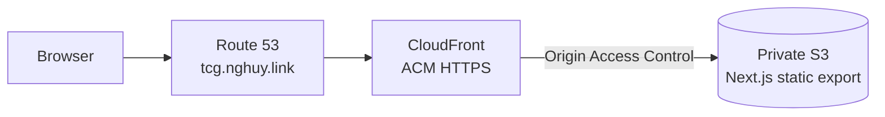

# Repository Baseline Implementation Plan

> **For agentic workers:** REQUIRED SUB-SKILL: Use superpowers:subagent-driven-development (recommended) or superpowers:executing-plans to implement this plan task-by-task. Steps use checkbox (`- [ ]`) syntax for tracking.

**Goal:** Create a collaboration-ready repository baseline for DevOps TCG before application implementation begins.

**Architecture:** Repository metadata establishes source-control, formatting, licensing, collaboration, and security conventions without adding runtime behavior. Documentation describes only the approved target architecture and current pre-implementation state; the existing application plan remains authoritative.

**Tech Stack:** Markdown, Git attributes and ignore rules, EditorConfig, MIT License

## Global Constraints

- Use the canonical extensionless `LICENSE` filename with the unmodified MIT License text and copyright `2026 Huy Nguyen`.
- Preserve the existing `.superpowers/` ignore rule.
- Ignore Terraform state and local inputs, but keep `.terraform.lock.hcl` and `*.tfvars.example` trackable.
- Do not claim that planned application commands or deployment workflows are currently usable.
- Do not add application code, dependencies, GitHub templates, CODEOWNERS, Dependabot, release automation, or a code of conduct.
- Keep the README concise and do not add standalone License, Contributing, or Changelog sections.
- Modify the existing application plan only where it currently assumes that `README.md` does not exist.

---

## Planned File Structure

```text
.
├── .editorconfig
├── .gitattributes
├── .gitignore
├── CONTRIBUTING.md
├── LICENSE
├── README.md
├── SECURITY.md
└── docs/superpowers/
    ├── plans/
    │   ├── 2026-08-13-devops-tcg.md
    │   └── 2026-08-14-repository-baseline.md
    └── specs/
        ├── 2026-08-13-devops-tcg-design.md
        └── 2026-08-14-repository-baseline-design.md
```

### Task 1: Repository Hygiene and Licensing

**Files:**
- Modify: `.gitignore`
- Create: `.editorconfig`
- Create: `.gitattributes`
- Create: `LICENSE`

**Interfaces:**
- Consumes: The approved MIT choice and planned Next.js, pnpm, Terraform, Vitest, and Playwright toolchain.
- Produces: Repository-wide tracking, line-ending, indentation, and licensing conventions used by every later task.

- [ ] **Step 1: Confirm the baseline metadata is absent**

Run:

```bash
test -f LICENSE
test -f .editorconfig
test -f .gitattributes
```

Expected: FAIL on `LICENSE` because the repository baseline has not been created.

- [ ] **Step 2: Expand the ignore rules**

Replace `.gitignore` with:

```gitignore
# Superpowers local artifacts
.superpowers/

# Dependencies
node_modules/
.pnpm-store/

# Next.js and frontend outputs
.next/
out/
dist/
build/

# Tests and tooling
coverage/
playwright-report/
test-results/
*.tsbuildinfo

# Logs
*.log
npm-debug.log*
pnpm-debug.log*
yarn-debug.log*
yarn-error.log*

# Environment and local configuration
.env
.env.*
!.env.example
!.env.*.example

# Terraform
**/.terraform/*
*.tfstate
*.tfstate.*
*.tfplan
tfplan
crash.log
crash.*.log
override.tf
override.tf.json
*_override.tf
*_override.tf.json
*.tfvars
!*.tfvars.example
.terraformrc
terraform.rc

# Editors
.idea/
.vscode/
*.swp
*.swo
*~

# Operating systems
.DS_Store
Thumbs.db
```

- [ ] **Step 3: Add editor and Git normalization rules**

Create `.editorconfig`:

```ini
root = true

[*]
charset = utf-8
end_of_line = lf
insert_final_newline = true
trim_trailing_whitespace = true
indent_style = space
indent_size = 2

[*.md]
trim_trailing_whitespace = false

[Makefile]
indent_style = tab
```

Create `.gitattributes`:

```gitattributes
* text=auto eol=lf

*.gif binary
*.ico binary
*.jpeg binary
*.jpg binary
*.png binary
*.webp binary
*.woff binary
*.woff2 binary
```

- [ ] **Step 4: Add the MIT License**

Create `LICENSE`:

```text
MIT License

Copyright (c) 2026 Huy Nguyen

Permission is hereby granted, free of charge, to any person obtaining a copy
of this software and associated documentation files (the "Software"), to deal
in the Software without restriction, including without limitation the rights
to use, copy, modify, merge, publish, distribute, sublicense, and/or sell
copies of the Software, and to permit persons to whom the Software is
furnished to do so, subject to the following conditions:

The above copyright notice and this permission notice shall be included in all
copies or substantial portions of the Software.

THE SOFTWARE IS PROVIDED "AS IS", WITHOUT WARRANTY OF ANY KIND, EXPRESS OR
IMPLIED, INCLUDING BUT NOT LIMITED TO THE WARRANTIES OF MERCHANTABILITY,
FITNESS FOR A PARTICULAR PURPOSE AND NONINFRINGEMENT. IN NO EVENT SHALL THE
AUTHORS OR COPYRIGHT HOLDERS BE LIABLE FOR ANY CLAIM, DAMAGES OR OTHER
LIABILITY, WHETHER IN AN ACTION OF CONTRACT, TORT OR OTHERWISE, ARISING FROM,
OUT OF OR IN CONNECTION WITH THE SOFTWARE OR THE USE OR OTHER DEALINGS IN THE
SOFTWARE.
```

- [ ] **Step 5: Verify tracking rules and file conventions**

Run:

```bash
test -f LICENSE
test -f .editorconfig
test -f .gitattributes
grep -Fqx 'Copyright (c) 2026 Huy Nguyen' LICENSE
git check-ignore -q frontend/node_modules/example
git check-ignore -q frontend/.next/server/app.js
git check-ignore -q frontend/coverage/index.html
git check-ignore -q infra/envs/prod/.terraform/providers/example
git check-ignore -q infra/envs/prod/terraform.tfstate
git check-ignore -q infra/envs/prod/prod.auto.tfvars
! git check-ignore -q frontend/pnpm-lock.yaml
! git check-ignore -q infra/envs/prod/.terraform.lock.hcl
! git check-ignore -q infra/envs/prod/terraform.tfvars.example
git diff --check
```

Expected: PASS. Generated and sensitive paths are ignored; dependency lockfiles and example variables remain trackable.

- [ ] **Step 6: Commit repository metadata**

```bash
git add .gitignore .editorconfig .gitattributes LICENSE
git commit -m "chore: add repository baseline metadata"
```

### Task 2: Project, Contribution, and Security Documentation

**Files:**
- Create: `README.md`
- Create: `CONTRIBUTING.md`
- Create: `SECURITY.md`
- Modify: `docs/superpowers/plans/2026-08-13-devops-tcg.md`
- Track: `docs/superpowers/plans/2026-08-14-repository-baseline.md`

**Interfaces:**
- Consumes: The approved DevOps TCG product design, repository-baseline design, implementation plan, and repository metadata from Task 1.
- Produces: An accurate pre-implementation landing page and contribution/security policies; Task 10 of the application plan later expands the README into a verified operator guide.

- [ ] **Step 1: Confirm project documentation is absent**

Run:

```bash
test -f README.md
test -f CONTRIBUTING.md
test -f SECURITY.md
```

Expected: FAIL on `README.md` because the documentation baseline has not been created.

- [ ] **Step 2: Create the pre-implementation README**

Create `README.md`:

````markdown
# DevOps TCG

A read-only concept study deck that presents DevOps topics through an accessible,
modern trading-card-inspired interface. The first release teaches the **Proxy**
concept and is designed for static delivery at
[tcg.nghuy.link](https://tcg.nghuy.link).

> [!IMPORTANT]
> DevOps TCG is currently in the pre-implementation phase. The product design
> and implementation plan are approved, but the frontend, infrastructure, and
> deployment workflows have not been built yet.

## Planned Experience

- One hardcoded Proxy study card with complementary front and back content.
- Mouse and keyboard card-flip interaction with reduced-motion support.
- Responsive presentation from 320-pixel mobile screens through desktop.
- No backend, database, authentication, browser persistence, or runtime content
  downloads.
- An original visual identity that does not copy proprietary trading-card
  artwork or layouts.

## Planned Architecture



The frontend will use Next.js 14, React 18, TypeScript, and Tailwind CSS. AWS
infrastructure will be managed with Terraform and deployed through GitHub
Actions using OpenID Connect instead of long-lived AWS credentials.

## Repository Status

The repository currently contains the approved specifications and plans:

- [Product design](docs/superpowers/specs/2026-08-13-devops-tcg-design.md)
- [Application implementation plan](docs/superpowers/plans/2026-08-13-devops-tcg.md)
- [Repository baseline design](docs/superpowers/specs/2026-08-14-repository-baseline-design.md)
- [Repository baseline implementation plan](docs/superpowers/plans/2026-08-14-repository-baseline.md)

Application directories such as `frontend/`, `infra/`, and `.github/workflows/`
will be added by the implementation plan.

## Roadmap

1. Build the typed static frontend and accessible card interaction.
2. Add responsive styling, unit tests, and browser acceptance tests.
3. Provision private S3, CloudFront, ACM, and Route 53 resources with Terraform.
4. Add pull-request validation and protected production deployment workflows.
5. Complete verified development, operations, and teardown documentation.
````

- [ ] **Step 3: Create contribution guidance**

Create `CONTRIBUTING.md`:

```markdown
# Contributing to DevOps TCG

Thank you for helping improve DevOps TCG. The project is currently
pre-implementation, so use the approved design and implementation plan as the
source of truth for scope and technical decisions.

## Before You Start

- Read the [product design](docs/superpowers/specs/2026-08-13-devops-tcg-design.md).
- Review the [implementation plan](docs/superpowers/plans/2026-08-13-devops-tcg.md).
- Keep changes focused on one plan task or one clearly described concern.
- Open an issue before proposing a material change to architecture or scope.

## Development Expectations

- Use Node.js 20, pnpm 9, and the Terraform versions defined by the project once
  their configuration files are available.
- Add or update tests for behavior changes.
- Run every available formatting, linting, type, test, build, and infrastructure
  check relevant to the changed files.
- Do not weaken security, accessibility, or test requirements to make a check
  pass.
- Never commit credentials, populated variable files, Terraform state, plan
  files that may contain sensitive values, or local environment files.

## Commits and Pull Requests

- Create a focused branch from the latest `main` branch.
- Use a concise conventional commit-style subject such as `feat:`, `fix:`,
  `docs:`, `test:`, `ci:`, or `chore:`.
- Explain what changed, why it changed, and how it was verified.
- Include screenshots for visible interface changes.
- Keep pull requests small enough to review confidently.
```

- [ ] **Step 4: Create security guidance**

Create `SECURITY.md`:

```markdown
# Security Policy

## Supported Versions

DevOps TCG is currently in pre-implementation and has no released version.
After the first release, security updates will target the latest version on the
`main` branch.

## Reporting a Vulnerability

Do not disclose suspected vulnerabilities in a public issue.

Use GitHub private vulnerability reporting for this repository when available.
If that channel is unavailable, email `huynguyen260398@gmail.com` with a concise
description, reproduction steps, potential impact, and any suggested
mitigation. Do not include active credentials or sensitive production data.

The maintainer will acknowledge the report, assess its impact, and coordinate a
fix and disclosure timeline when the issue is confirmed.

## Protecting Cloud and Infrastructure Data

Never commit:

- AWS access keys, session tokens, account credentials, or GitHub secrets.
- Terraform state or state backups.
- Terraform plans that may contain sensitive values.
- Populated `.tfvars` files or backend configuration containing account data.
- Local `.env` files or deployment credentials.

If a credential is exposed, revoke or rotate it immediately before removing it
from repository history.
```

- [ ] **Step 5: Integrate the baseline README with the application plan**

In `docs/superpowers/plans/2026-08-13-devops-tcg.md`, change:

```markdown
- Create: `README.md`
```

to:

```markdown
- Modify: `README.md`
```

Change:

```markdown
- [ ] **Step 1: Write the root guide**

Create these exact top-level sections:
```

to:

```markdown
- [ ] **Step 1: Expand the root guide**

Update the existing pre-implementation README to use these exact top-level sections:
```

- [ ] **Step 6: Verify documentation accuracy and consistency**

Run:

```bash
test -f README.md
test -f CONTRIBUTING.md
test -f SECURITY.md
rg -n 'pre-implementation|Proxy|Next.js 14|Terraform|OpenID Connect' README.md
rg -n 'credentials|Terraform state|tfvars' CONTRIBUTING.md SECURITY.md
rg -n -- '- Modify: `README.md`|Step 1: Expand the root guide' docs/superpowers/plans/2026-08-13-devops-tcg.md
! rg -n 'TBD|TODO|FIXME|PLACEHOLDER' README.md CONTRIBUTING.md SECURITY.md
git diff --check
```

Expected: PASS. Documentation describes the approved project and current status, security-sensitive files are called out, and Task 10 now updates the baseline README.

- [ ] **Step 7: Commit repository documentation**

```bash
git add README.md CONTRIBUTING.md SECURITY.md docs/superpowers/plans/2026-08-13-devops-tcg.md docs/superpowers/plans/2026-08-14-repository-baseline.md
git commit -m "docs: add repository collaboration guides"
```

- [ ] **Step 8: Run final baseline verification**

Run:

```bash
test -f README.md
test -f LICENSE
test -f CONTRIBUTING.md
test -f SECURITY.md
test -f .gitignore
test -f .editorconfig
test -f .gitattributes
grep -Fqx 'Copyright (c) 2026 Huy Nguyen' LICENSE
git check-ignore -q frontend/node_modules/example
git check-ignore -q infra/envs/prod/terraform.tfstate
! git check-ignore -q frontend/pnpm-lock.yaml
! git check-ignore -q infra/envs/prod/.terraform.lock.hcl
! git check-ignore -q infra/envs/prod/terraform.tfvars.example
git diff --check
git status --short
```

Expected: every content and ignore assertion passes. `git status --short` shows no unexpected files; the existing untracked application plan is included by Task 2 rather than discarded.
